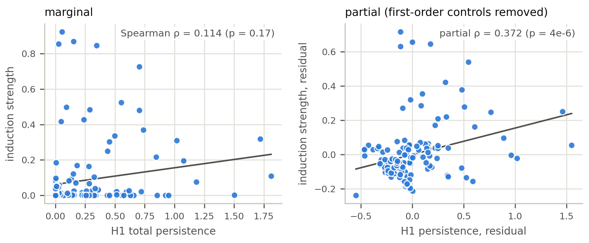
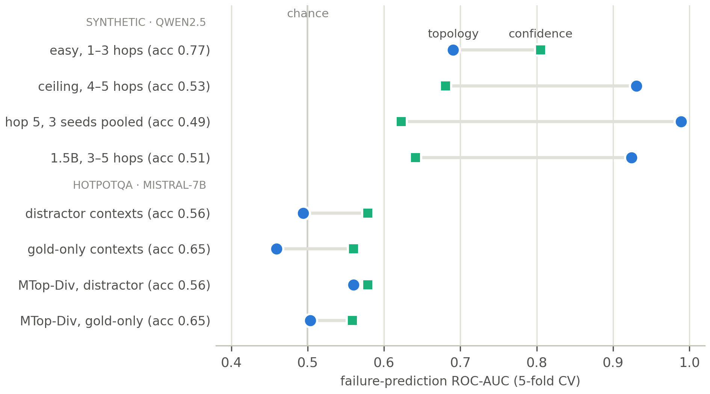

# When Does Attention Topology Know the Model Is Wrong? Mapping the Narrow Regime Where Persistent Homology Beats Confidence

**Eduardo Trunci**

*All numbers in this document are generated by `src/write_paper.py` from
machine-checked statistics JSONs; no value is hand-typed. Code and per-experiment
verdict files: this repository.*

## Abstract

Topological data analysis (TDA) of transformer attention is increasingly proposed for
interpretability and hallucination detection, but is rarely benchmarked against the
trivial baselines that could explain it away. We conduct an adversarial audit — a
spike study and fifteen follow-up experiments — of H1 persistent homology on
attention graphs, testing every proposed
use against the cheapest available competitor. **Three claims survive.** (1) H1
persistence carries signal about induction circuits that first-order attention
statistics do not — a suppression effect invisible to marginal correlation
(ΔR² = 0.074, nested-F p = 0.00044; replicated in a second model) — and ablating
cycle edges causally damages induction behaviour at budget-matched controls, though the
effect is budget-sensitive and not universal across scale. (2) As a failure predictor,
topology is *regime-conditional*: redundant with the model's own confidence when
accuracy is high (0.77–0.85), but near-perfect when a small model is at its capability
ceiling on synthetic multi-hop reasoning (accuracy 0.525: topology AUC 0.930 vs
confidence 0.681; at five hops 1.000 vs 0.617; replicated across
three seeds and a second model). (3) The mechanism is scale-dependent: at 0.5B
parameters topology proxies attention entropy (r = 0.925, adding ΔAUC =
0.000 beyond first-order controls), while at 1.5B it adds ΔAUC = 0.216
beyond those controls (p = 0.0312). **Everything else falls.** Topology loses to
raw attention magnitude as a circuit attributor (AUC 0.501 vs 0.976 on
induction; 0.458 vs 0.963 on IOI), adds nothing as a pruning criterion, and its
apparent "information-flow" signal decomposes first into graph connectivity and then
into a sequence-length artifact. Critically, the failure-prediction result does not
transfer to real QA: on the benchmark and model family of the concurrent TOHA method
(Mistral-7B-Instruct / HotpotQA), the identical features sit at chance (AUC 0.494, vs
TOHA's engineered 0.71), remain at chance after length residualization
(0.545), and remain at chance with supervised head selection on distractor-free
gold contexts (0.499). Nor is the boundary merely our featurization:
reimplementing TOHA's own MTop-Div (generation-time answer-to-prompt divergence)
on the same items also fails to beat chance under fold-internal head selection
(0.560 distractor / 0.504 gold). The regime where attention topology beats
confidence is real but narrow: clean, template-generated reasoning at the model's
capability boundary. We offer the audit methodology — control first-order statistics,
verify instruments, benchmark against magnitude and confidence — as the durable
contribution.

## 1. Introduction

The attention matrices of a transformer induce, at every head, a weighted directed
graph over token positions. A growing literature applies topological data analysis to
these graphs — persistent homology, discrete Morse theory, sheaf Laplacians — and
reports that the resulting descriptors track linguistic structure, reasoning, and
hallucination. The appeal is clear: topology promises a principled, coordinate-free
summary of *how* attention is organized, beyond what any single edge weight conveys.

The risk is equally clear. Attention graphs come with extremely cheap covariates —
the raw magnitude of an edge, the entropy of a row, the distance between attended
positions, the *length of the sequence* — and topological statistics are functions of
the same graph, so they are correlated with all of these by construction. A
topological feature that "predicts reasoning" may be a sequence-length meter; a cycle
score that "localizes a circuit" may be a noisy copy of edge magnitude. Most TDA-for-
interpretability papers do not run these controls. This paper is the audit we wished
existed: a single H1-persistence pipeline, held fixed, pushed through every use it has
been proposed for — *description, attribution, pruning, causal ablation, and failure
prediction* — with each claim required to beat the strongest trivial baseline we could
construct, under pre-registered verdict rules.

The audit produces one positive result we believe is new, one mechanistic
decomposition, and a catalogue of instructive failures:

1. **A regime-conditional failure-prediction claim, with its limit mapped.**
   Per-example H1 features predict whether the model's answer will be *wrong*, beyond
   the model's own confidence — but only when the model is at its capability ceiling
   (accuracy near 0.5) on clean, template-generated multi-hop reasoning. On easy tasks
   the signal is fully redundant with confidence; on naturalistic multi-hop QA at the
   same ~0.5 accuracy it vanishes entirely, surviving neither length residualization,
   nor supervised head selection, nor replacement of our features by TOHA-style
   generation-time divergence. The regime is real, replicable (three seeds, two
   model scales) — and narrow.

2. **A mechanism that changes with scale.** In the regime where topology works, *why*
   it works differs by model size: at 0.5B parameters the topological features are an
   attention-entropy proxy; at 1.5B they carry structural information that entropy and
   the other first-order statistics do not.

3. **Calibrated negatives for the rest of the design space.** Against attention
   magnitude, topology is not competitive as a circuit attributor (induction *and*
   IOI); under a verified causal instrument, neither beats random at small budgets; as
   a pruning criterion discrete-Morse retention loses to magnitude; and a sheaf
   "information-flow" signal over the residual stream decomposes, in two controlled
   steps, into graph connectivity and then into sequence length.

We state what does survive baseline control precisely because so much does not: H1
persistence is a genuine, *non-redundant* correlate of induction-circuit strength
(a textbook suppression effect — the marginal correlation is near zero), and
gap-constrained cycle edges are causally load-bearing for induction behaviour under a
directed, budget-matched ablation. Topology is not decorative; it is simply much
narrower than proposed.

## 2. Related work

**Topological probes of attention.** Closest to our failure-prediction experiments is
TOHA (Bazarova et al., ACL 2026; arXiv:2504.10063v3), which engineers topological
features of attention maps for hallucination detection and reports AUROC 0.71 on
HotpotQA with Mistral-7B-Instruct-v0.1 (the HotpotQA numbers appear in the v3
revision) — the setting of our Experiments 14–16, which use v0.3 of the same model
(§7). TOHA validates
the *direction*; our contribution relative to it is the regime map (when topology adds
beyond confidence and when it cannot), head-to-head nulls on their own benchmark for
both hand-specified H1 features and a reimplementation of their MTop-Div metric
(Experiment 16), and the scale-dependent mechanism. Attention-based
uncertainty probes more broadly include KL-divergence attention probes
(van Dijk, 2026) and semantic-entropy methods (Farquhar et al., 2024), which our
confidence baseline proxies in spirit: any topology claim must beat what the model
already tells us for free.

**Mechanistic interpretability circuits.** We use the induction circuit (Olsson et
al., 2022; Elhage et al., 2021) and the indirect-object-identification (IOI) circuit
(Wang et al., 2023) as ground truth for attribution and causal tests, precisely
because both are independently characterized.

**TDA machinery.** Persistent homology on flag (clique) complexes of weighted graphs
(Edelsbrunner & Harer, 2010; GUDHI), discrete Morse theory (Forman, 1998), and
cellular sheaves with spectral Laplacians (Hansen & Ghrist, 2019; cf. Neural Sheaf
Diffusion, Bodnar et al., 2022). We use these as fixed, non-learned descriptors; no
component of the pipeline is trained on the labels except where explicitly stated
(the supervised head-selection probe of §5.3, which is fold-internal).

## 3. Methods

**Topology pipeline (held fixed throughout).** For each (layer, head) attention matrix
A: max-symmetrize, sparsify to the top-k entries per row (k = 8 unless stated), build
the flag complex of the resulting weighted graph, and compute H1 persistent homology
over the edge-weight filtration. Per-head scalars: total and maximum H1 persistence;
per-example pooled features: mean persistence, max persistence, and the fraction of
heads with non-trivial H1 (`topo_frac_nontrivial`).

**First-order controls.** Every regression or classifier that credits topology must
beat the same model with only cheap attention statistics: mean attention distance,
off-diagonal mass, row entropy, and KL-from-uniform — plus, where relevant, sequence
length and entity count. The confidence baseline is the answer-token logit margin.

**Verdict rules.** Each experiment pre-registers a GREEN/PARTIAL/RED rule before the
run (e.g., "GREEN iff ΔR² ≥ 0.02 *and* nested-F p < 0.05"; "GREEN iff topology adds
AUC beyond confidence at paired-Wilcoxon p < 0.05"). All verdicts are machine-checked
fields in per-experiment JSON files, from which this document is generated.

**Models and tasks.** Qwen2.5-0.5B/1.5B-Instruct (synthetic kinship/ordering
reasoning, 1–5 hops), GPT-2 small/medium and distilgpt2 (induction, previous-token,
duplicate-token, IOI circuits), Mistral-7B-Instruct-v0.3 (HotpotQA bridge questions,
full-distractor and gold-only contexts). Statistical tests are paired and
non-parametric throughout (Wilcoxon, Mann-Whitney, BH correction where multiple heads
are tested); failure-prediction AUCs are 5-fold cross-validated logistic probes. ΔAUC
significance is a one-sided Wilcoxon signed-rank test over the five fold-wise deltas;
note that with five folds the smallest attainable p-value is 1/32 ≈ 0.031, reached
exactly when all five folds move in the predicted direction — reported p-values at
that value are at the test's resolution floor. For the headline ΔAUC claims we
therefore also report an item-level paired bootstrap (B = 10,000) over pooled
out-of-fold predictions from the same probes (§5.3).

## 4. What survives

### 4.1 Topology tracks attempted reasoning (spike study)

On 60 matched 1-hop/2-hop prompt pairs (Qwen2.5-0.5B, 336 heads), 55.9% of
head-observations carry a persistent H1 cycle, and 196/336 heads
discriminate hop count (paired Wilcoxon, BH-corrected). The effect is two-sided
(129 heads increase persistence with hops, 67 decrease) and survives an
exactly length-matched prompt family — an early warning that *length control matters*,
which §5 vindicates.

### 4.2 A non-redundant correlate of induction — the suppression effect (Experiments 2–4)

Marginally, H1 persistence barely correlates with independently-measured induction
strength across GPT-2's 144 heads (Spearman ρ = 0.114, p = 0.172); the trivial
attention-distance scalar does better (0.446). A naive reading kills the
topology story here. The nested test reverses it: adding H1 persistence to an OLS
of induction strength on the first-order controls raises R² from 0.137 to 0.211
(ΔR² = 0.074, F p = 0.00044), and the *partial* Spearman is 0.372 — an order of
magnitude above the marginal. H1's correlation with the controls had masked its
unique signal. Generalizing over 2 models × 3 circuits:

| model | circuit | ΔR² | nested-F p | partial ρ | verdict |
|---|---|---|---|---|---|
| gpt2 | induction | 0.074 | 0.00044 | 0.372 | GREEN |
| gpt2 | previous-token | 0.001 | 0.31897 | -0.119 | RED |
| gpt2 | duplicate-token | 0.000 | 0.90999 | 0.237 | RED |
| distilgpt2 | induction | 0.119 | 0.00113 | 0.443 | GREEN |
| distilgpt2 | previous-token | 0.011 | 0.05266 | -0.033 | RED |
| distilgpt2 | duplicate-token | 0.001 | 0.79379 | 0.095 | RED |

2 of 6 cells are GREEN — induction in both models, neither
positional circuit. Topology earns its keep exactly where the circuit has
multi-position relational structure, and nowhere simpler.

*Figure 1: The suppression effect (GPT-2, 144 heads; Experiment 3). Marginally,
per-head H1 persistence is uncorrelated with independently-measured induction
strength (left). Residualizing both variables on the first-order attention
controls reveals the relationship (right): topology carries signal the cheap
statistics mask.*

### 4.3 Cycle edges are causally load-bearing — at adequate budget (Experiments 5–6)

Descriptively, the H1 cycle edges of induction heads concentrate at the induction
copy distance S (the offset between the two occurrences of the repeated subsequence):
the fraction of cycle edges at gap ≈ S is 0.233 in induction heads vs 0.013
elsewhere (Mann-Whitney p = 0.00043). Causally, a directed, edge-exact, budget-matched ablation
(equal edge counts for cycle / magnitude / random conditions) damages induction
behaviour more than both controls in distilgpt2 (median damage 0.0043, vs-random
p = 0.0017). In gpt2 the verdict tracks the *treatment budget*:

| top_k | edges ablated/seq | cycle median damage | vs random p | verdict |
|---|---|---|---|---|
| 8 | 2.5 | 0.0000 | 0.5000 | INCONCLUSIVE |
| 16 | 7.8 | 0.0001 | 0.5452 | RED |
| 24 | 24.5 | 0.0600 | 0.0024 | GREEN |

gpt2-medium remains negative at adequate budget (damage 0.0113, p = 0.0757):
more heads spread the circuit, increasing redundancy. The causal claim is real but
**budget-sensitive and not universal across scale** — the honest version of "cycles
matter".

## 5. What falls

### 5.1 Attribution: attention magnitude wins, twice (Experiments 9–11)

If topology is useful for explainability it should at least *localize* known circuit
edges. It does not. ROC-AUC at recovering the ground-truth copy edge within induction
heads: magnitude 0.976, cycle participation 0.501 (chance), sheaf discord
0.581. On IOI name-mover heads — chosen specifically because attention there is
diffuse, handicapping magnitude — magnitude still scores 0.963, against cycle
participation 0.458 (below chance) and sheaf discord 0.606. With a *verified*
causal instrument (ablating the known
END→IO edge produces median damage 0.513, p = 0.000050; n = 48), no saliency
beats random at small budgets — median damage: cycle 0.028 (p = 0.276),
magnitude -0.132, sheaf -0.187, the latter two *negative* (ablating their top
edges mildly helps). The instrument works; the saliencies don't.

### 5.2 "Information flow" collapses to shape, then to length (Experiments 8, 9a, 9b)

A cellular sheaf over the residual stream (PCA stalks, Procrustes restriction maps)
initially appeared to add ΔR² = 0.051 beyond H1 at predicting hop count — the
project's most exciting intermediate result. Decomposition killed it in two steps.
First, the added signal was carried entirely by the Fiedler value (graph algebraic
connectivity — *shape*), ΔR² = 0.0436; the genuinely flow-valued discord
feature added 0.0076 (p = 0.0875) once Fiedler was controlled. Second,
Fiedler itself died under length control: token count and entity count alone explain
R² = 0.773 of hop variance, and Fiedler's contribution beyond a
length-augmented baseline is ΔR² = 0.0092, below the pre-registered 0.02 floor.
Both the "flow beats shape" and "better shape statistic" readings were withdrawn.

### 5.3 Failure prediction does not survive real QA (Experiments 7, 12–16)

*Figure 2: The regime map. Failure-prediction AUC of topology (blue circles)
vs the model's own confidence (green squares) across the eight evaluation
regimes, each labeled with task accuracy. Topology decisively beats confidence
only on synthetic multi-hop reasoning at the capability ceiling (middle rows);
on easy tasks it is redundant, and on naturalistic HotpotQA (bottom group)
it collapses to chance — for our H1 features and for the TOHA-style MTop-Div
reimplementation alike (bottom two rows).*

This is the audit's sharpest arc. On easy synthetic reasoning (accuracy 0.772),
topology predicts errors above chance (AUC 0.690) but adds nothing beyond
confidence (0.805) — and contradictory distractors do not change this (they
*raised* accuracy from 0.796 to 0.850, the model resolving explicit
contradictions correctly). At the capability ceiling the picture inverts: on 4–5-hop
problems (accuracy 0.525), topology reaches AUC 0.930 against confidence's
0.681 (ΔAUC = 0.245, p = 0.0312 — every fold positive, the floor of the
five-fold test, §3); at five hops, 1.000 vs
0.617. Replication: three seeds pooled (n = 360, accuracy 0.508),
hop-5 topology 0.989 vs confidence 0.623; a second model
(1.5B, accuracy 0.506) gives topology 0.924 vs confidence 0.641.
The item-level bootstrap (§3) removes any fold-count worry: pooled across seeds
(n = 360), topology beyond confidence gives ΔAUC = 0.212, 95% CI
[0.163, 0.264]; the 1.5B model's topology-beyond-controls ΔAUC = 0.214,
CI [0.147, 0.285] — neither interval approaches zero.

**Mechanism, by scale.** For the 0.5B model the explanation is deflationary: at hop 5
the first-order controls alone reach AUC 0.991, matching topology's
0.989; r(topology, attention entropy) = 0.925; topology adds
ΔAUC = 0.000 beyond the controls. Topology *is* an entropy meter here. For the
1.5B model it is not: controls reach 0.734, adding topology lifts it to
0.948 (ΔAUC = 0.216, p = 0.0312) — a structural signal beyond
entropy, appearing only at the larger scale.

**The boundary.** On TOHA's benchmark and model family — Mistral-7B-Instruct on
HotpotQA bridge questions, full 10-paragraph distractor contexts, n = 200, accuracy
0.565 (inside the miscalibration band) — the identical features are at chance:
topology AUC 0.494, confidence 0.579, TOHA's engineered features 0.71.
Diagnosis: the prompts span 210–3739 tokens and the pooled H1 features
track length almost perfectly (ρ = 0.947 with sequence length) while length is
uninformative about correctness (ρ = 0.004) — the features are length meters
on a dataset where length is noise. But the obvious rescue fails. Residualizing
length lifts topology only to 0.545; and re-running the entire experiment with
*gold-only* contexts (the two supporting paragraphs; length std 88 tokens, no
distractors, accuracy 0.650) leaves pooled (0.459), length-residualized
(0.478), and per-head supervised head-selected (0.499) topology all at
chance against confidence (0.560). Geometry control does not rescue the
features; the boundary is the move from template-generated to naturalistic tasks
itself.

**Engineered features do not cross it either.** The remaining hypothesis was that
the boundary is *feature construction*: our features summarize prompt-encoding
persistence, while TOHA scores how the generated answer's tokens attach to the
prompt. Experiment 16 tests this by reimplementing TOHA's MTop-Div (the minimal
spanning forest cost attaching answer tokens to the prompt in generation-time
attention, per head, length-normalized) on the same 200 items, with the TOHA
protocol's top-10 head selection made fold-internal. Pre-registered verdict:
RED in both geometries. Head-selected MTop-Div reaches AUC 0.560
(95% CI [0.479, 0.641]) on distractor contexts and 0.504
(CI [0.417, 0.589]) on gold-only contexts — chance in both, adding nothing
beyond confidence or response-entropy controls, and far from TOHA's reported
0.71 (pooled variants: 0.558 / 0.541). Whatever separates our
setting from TOHA's reported result, it is not the choice between hand-specified
persistence and their divergence metric.

### 5.4 Pruning (Experiment 1)

At equal per-head edge budget, retaining discrete-Morse critical cells loses to
plain magnitude retention on WikiText-2 perplexity:

| method | mean PPL |
|---|---|
| unpruned | 51.3 |
| magnitude | 123.4 |
| window | 12252.7 |
| dmt | 70365.6 |
| random | 189756.6 |

The paired per-example loss test agrees (DMT worse than magnitude, p < 0.001).
Topology does not tell you which edges to keep.

## 6. Discussion

**For the TDA-for-interpretability literature.** Three controls did all the killing
in this audit, and we recommend them as a minimum standard: (i) *benchmark against
attention magnitude* — it is nearly free and was a near-perfect attributor in both of
our circuit settings; (ii) *benchmark against model confidence* — any failure
predictor must add to what the logit margin already encodes; (iii) *control sequence
length explicitly* — two of our own intermediate positives (Fiedler, and implicitly
the real-QA features) were length artifacts, and H1 statistics on naturalistic text
correlate with length at ρ > 0.9. Where instruments are causal, *verify them* with a
ground-truth condition before interpreting a null or a positive.

**What topology is for, on this evidence.** Not attribution, not pruning, not flow.
The defensible uses are (a) as a *descriptive, non-redundant correlate* of relational
circuit structure — the suppression effect of §4.2 means topology sees something
first-order statistics genuinely miss, even though that something is not practically
extractable by our hand-specified features outside controlled settings; and (b) as a
*failure signal in the narrow regime*: clean task geometry, model at its capability
ceiling, where it can be dramatically better than confidence (1.000 vs
0.617 at hop 5). We conjectured that TOHA's 0.71 on naturalistic QA
meant engineered features could cross the boundary our hand-specified ones cannot —
that the gap was feature construction. Experiment 16 falsified that conjecture in
our setting: TOHA's own MTop-Div metric, reimplemented on our items, is also at
chance (0.560 / 0.504). On our evidence, no attention-topology
featurization tested — hand-specified or engineered — survives naturalistic QA.
Reconciling this with TOHA's reported result now requires diagnosis rather than
assertion: candidate explanations are protocol differences (annotation-based
hallucination labels vs our substring-match correctness, their item mix vs our
bridge-only slice, sampling vs greedy decoding, their probe-set head-selection
budget, and the model revision — TOHA evaluates Mistral-7B-Instruct-v0.1, we v0.3).
TOHA's released implementation makes an artifact-level comparison on our items
feasible, and adjudicating these axes is the natural next experiment.

**Scale.** The mechanistic split — entropy proxy at 0.5B, entropy-orthogonal signal
at 1.5B — cautions against extrapolating any single-model topology result in either
direction. What topology *measures* appears to change with capacity.

## 7. Limitations

Runs are small and CPU/single-GPU scale: circuits on GPT-2-class models (n_seqs ≤ 12,
single seeds for the causal budget sweeps), synthetic reasoning on 0.5B/1.5B models,
and n = 200 items for each HotpotQA condition. The confidence baseline is a logit
margin, not a calibrated probability. The sheaf construction is non-learned. Gold-only
accuracy (0.650) sits above the deep-miscalibration band where the synthetic effect
is strongest, so Experiment 15 jointly tests "real task + easier regime"; its
supervised head-selection probe is far simpler than TOHA's featurization. Experiment
16 closes part of that gap — it scores TOHA's own metric — but is still not a full
replication of their protocol: we use greedy decoding, substring-match correctness
labels rather than annotated hallucination labels, bridge questions only, and
fold-internal head selection on ≤160 training items; and our runs use
Mistral-7B-Instruct-v0.3 where TOHA's published numbers are for v0.1. Experiment 16
is a from-paper reimplementation of the MTop-Div metric rather than a run of TOHA's
released artifact; a null here bounds MTop-Div *under our
evaluation*, not TOHA's published result. All synthetic results use two task
families (kinship, ordering) and template prompts. The fold-level Wilcoxon p-values
(0.0312) sit at the resolution floor of a five-fold test (§3); the item-level
bootstrap CIs of §5.3, whose lower bounds stay well clear of zero, carry the
statistical weight of the ΔAUC claims.

## 8. Conclusion

Attention-graph topology, audited adversarially, is neither decorative nor a
panacea. It carries genuine signal that first-order statistics miss — visible only
under suppression-aware controls — and in one sharply bounded regime it is a far
better failure detector than the model's own confidence. Outside that regime, every
proposed use we tested is matched or beaten by a baseline costing nothing. We offer
the regime map, the scale-dependent mechanism, and above all the audit methodology as
the contributions, and we encourage the field to treat "beats magnitude, confidence,
and length" as the entry bar for topological claims about transformers.

## References

- Bazarova, A., et al. (2026). *Hallucination Detection in LLMs with Topological
  Divergence on Attention Graphs.* ACL 2026. arXiv:2504.10063 (v3; the HotpotQA
  results cited here appear from v3 onward).
- Bodnar, C., et al. (2022). *Neural Sheaf Diffusion: A topological perspective on
  heterophily and oversmoothing in GNNs.* NeurIPS 2022.
- Edelsbrunner, H., & Harer, J. (2010). *Computational Topology: An Introduction.*
  AMS.
- Elhage, N., et al. (2021). *A Mathematical Framework for Transformer Circuits.*
  Transformer Circuits Thread.
- Farquhar, S., et al. (2024). *Detecting hallucinations in large language models
  using semantic entropy.* Nature 630.
- Forman, R. (1998). *Morse theory for cell complexes.* Advances in Mathematics 134.
- Hansen, J., & Ghrist, R. (2019). *Toward a spectral theory of cellular sheaves.*
  Journal of Applied and Computational Topology 3.
- Olsson, C., et al. (2022). *In-context Learning and Induction Heads.* Transformer
  Circuits Thread.
- The GUDHI Project. *GUDHI User and Reference Manual.*
- van Dijk, G. (2026). *Detecting Hallucinations in Large Language Models via
  Internal Attention Divergence Signals.* arXiv:2605.05025.
- Wang, K., et al. (2023). *Interpretability in the Wild: A Circuit for Indirect
  Object Identification in GPT-2 small.* ICLR 2023.
- Yang, Z., et al. (2018). *HotpotQA: A Dataset for Diverse, Explainable Multi-hop
  Question Answering.* EMNLP 2018.
